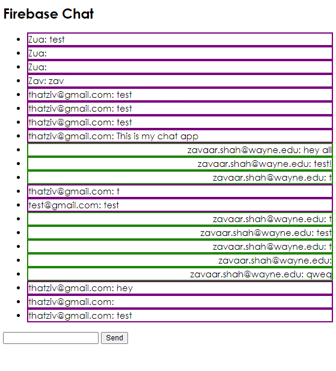
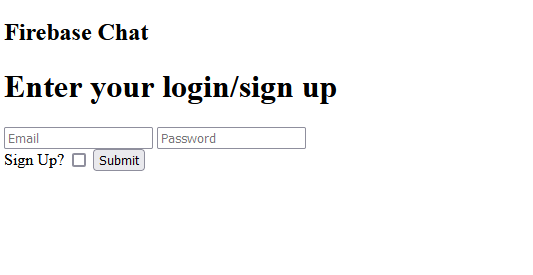

# Google Firebase Workshop

## Get authenticated

> Follow the instructions in [guide.pdf](guide.pdf) to get your json auth file.

___

## Project 1 'pymessages'


CRUD (create, read, update, delete) messages in a python console environment.

Target functionalities:
* Firestore update, query, delete, add

## Project 2 'TODOs' web app


CRUD app that manages TODOs in a traditional HTML/JS environment.


### Change your Firestore rules for unauthenticated access FOR ANYONE

```
rules_version = '2';
service cloud.firestore {
  match /databases/{database}/documents {
    match /{document=**} {
      allow read, write;
    }
  }
}
```

## Project 3 `chat-app` realtime, authenticated chat application

Main interface


Login
